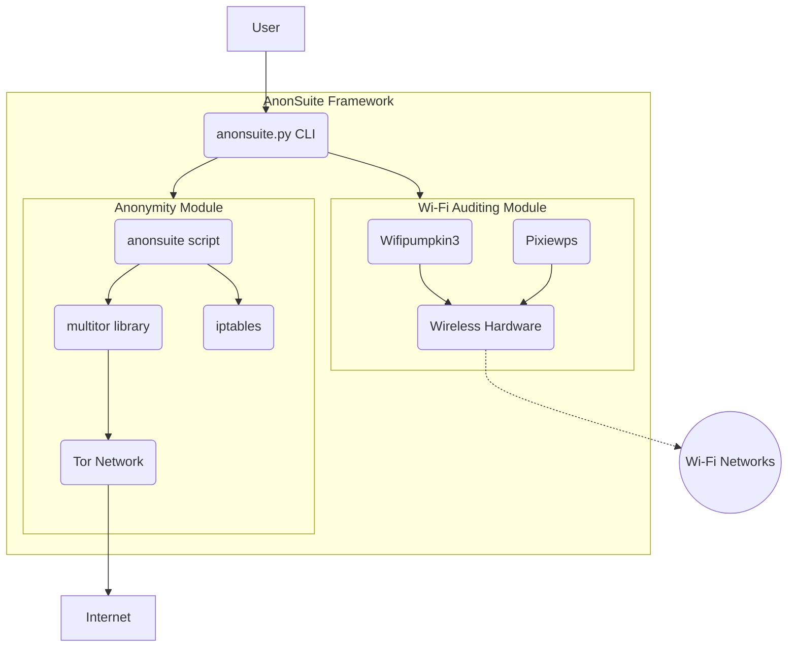

# AnonSuite Architecture

## Overview

AnonSuite is designed as a modular, command-line-driven toolkit that wraps four independent, open-source security tools into a single, cohesive application. The architecture prioritizes separation of concerns, allowing each tool to operate as a distinct module managed by a central orchestrator.

## Core Components

1.  **CLI Orchestrator (`anonsuite.py`):**
    *   **Technology:** Python 3.
    *   **Responsibility:** Acts as the main user-facing entry point. It presents a menu-driven interface that routes user commands to the appropriate backend module. It does not contain any core security logic itself but is responsible for launching and managing the other components.

2.  **Anonymity Module:**
    *   **Responsibility:** Manages system-wide network anonymization.
    *   **Sub-components:**
        *   `anonsuite` (Bash Script): A refactored script derived from `kali-anonsurf` that controls system `iptables` to route all traffic.
        *   `multitor` (Bash Library): A library derived from the `multitor` project, responsible for creating and managing multiple Tor instances.
    *   **Interaction:** The `anonsuite` script calls the `multitor` library to establish the Tor connections and then applies the routing rules.

3.  **Wi-Fi Auditing Module:**
    *   **Responsibility:** Provides tools for wireless network security assessment.
    *   **Sub-components:**
        *   `wifipumpkin3` (Python Project): A full-featured framework for Rogue AP attacks. It is launched as a subprocess.
        *   `pixiewps` (C Program): A compiled binary for WPS pixie-dust attacks. It is also launched as a subprocess.

## Architecture Diagram

